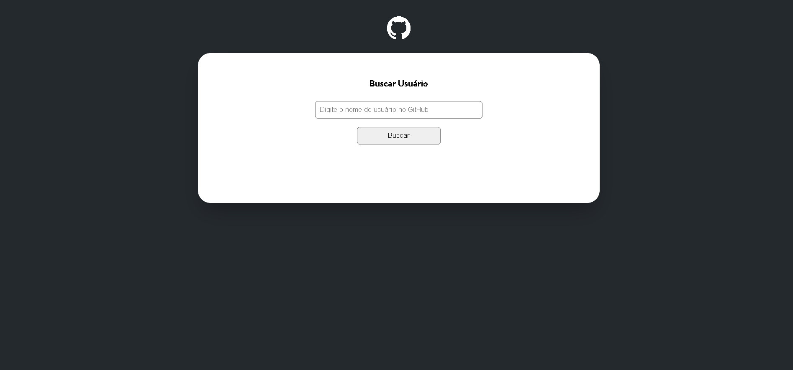

# ⚡Projeto-fetch-github-api

Este projeto é uma aplicação web que permite buscar usuários do GitHub e exibir suas informações, como nome, bio e repositórios públicos.



## 🚀 Tecnologias Utilizadas

- HTML

- CSS

- JavaScript

- GitHub API

## 📂 Estrutura do Projeto
````
src
├── css
│ ├── reset.css
│ └── styles.css
├── images
│ ├── exemplo-imagem.png
│ └── gif-gitHub.gif
├── scripts
│ ├── objects
│ │ ├── screen.js
│ │ └── user.js
│ ├── services
│ │ ├── events.js
│ │ ├── repositories.js
│ │ ├── user.js
│ │ └── variables.js
│ └── index.js
├── index.html
└── README.md
````
## 🎯 Funcionalidades

✅ Busca de usuários pelo nome de usuário do GitHub✅ Exibição de informações do perfil (foto, nome e bio)✅ Listagem dos últimos repositórios públicos✅ Exibição de mensagem de erro caso o usuário não seja encontrado✅ Estilização responsiva para melhor experiência do usuário

## 📦 Como Rodar o Projeto

Clone este repositório:
````
git clone https://github.com/cassio-leite/projeto-fetch-github-api.git
````
Acesse a pasta do projeto:
````
cd projeto-fetch-github-api
````
Abra o arquivo index.html no navegador.

## 🔗 API Utilizada

Este projeto utiliza a GitHub API para obter os dados dos usuários e seus repositórios.

Endpoints Utilizados:

https://api.github.com/users/{username} - Obtém as informações do usuário.

https://api.github.com/users/{username}/repos?per_page=10 - Obtém os últimos 10 repositórios públicos.


## ✨ Autor

Desenvolvido por:
- Linkedin - [@Cassio leite](https://www.linkedin.com/in/cassio-leite/).
- Se gostou do projeto, deixe uma ⭐ e contribua! 🚀

